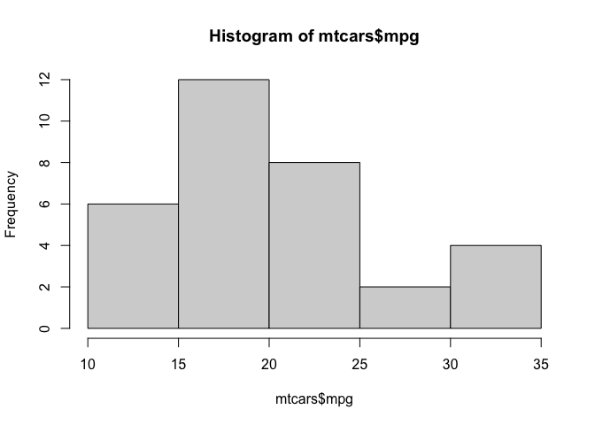
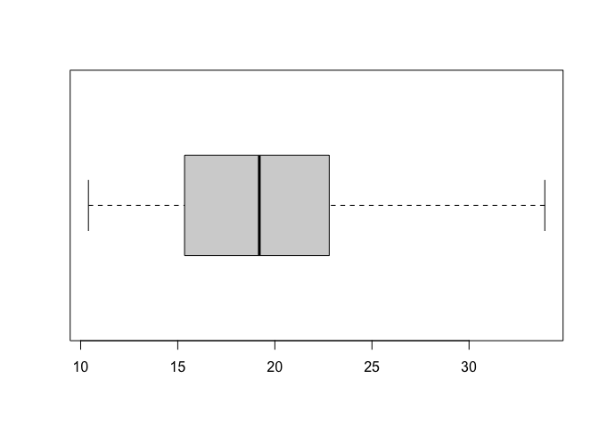
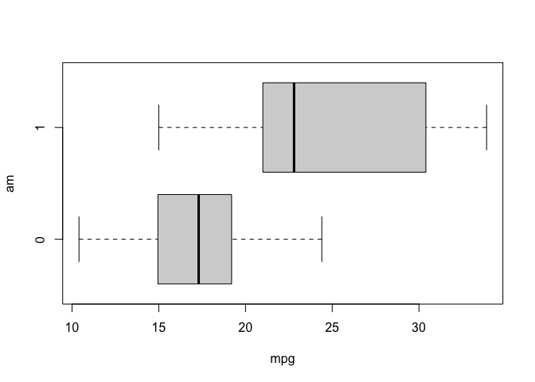
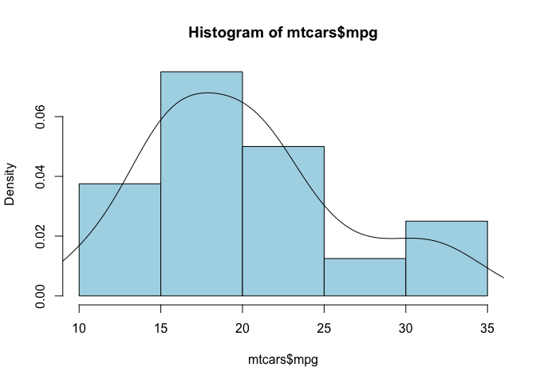
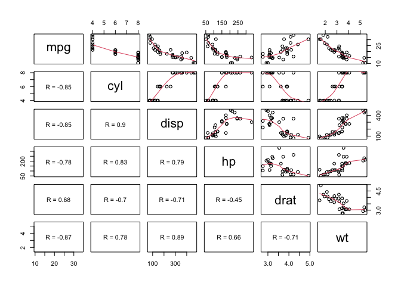
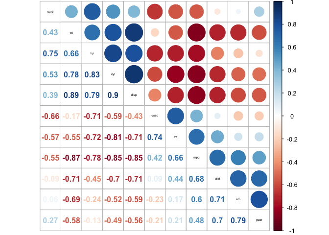
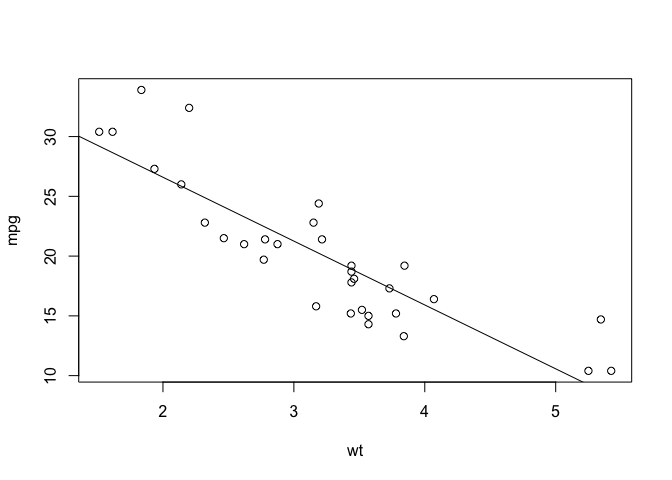
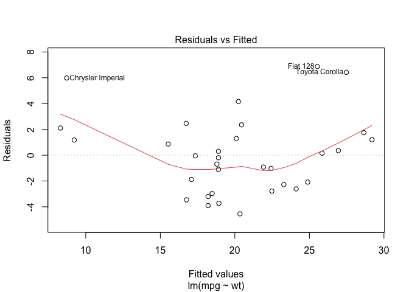
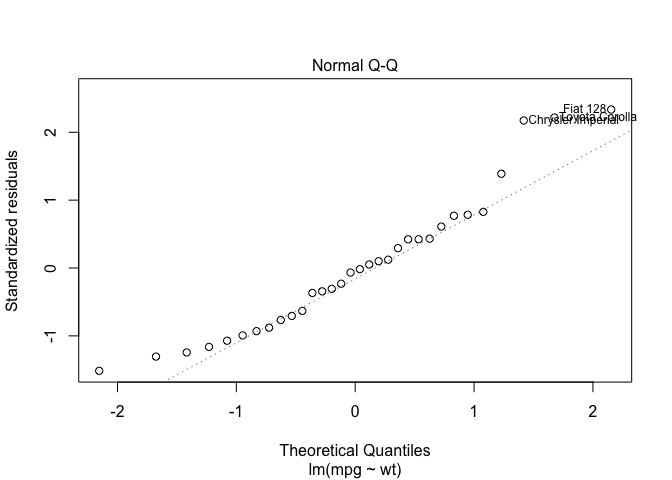
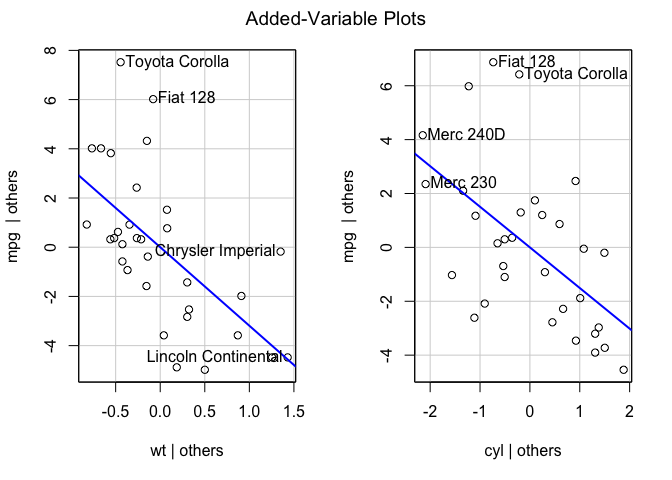

#### Libraries

``` r
library(mosaic) # simplify some R statistical procedures
library(car) # added variable plot, other linear model procedures
library(leaps) # model selection
library(corrplot) # correlation plot
```

#### loading a built-in dataset and show the first 6 rows

``` r
data("mtcars")
head(mtcars)
```

    ##                    mpg cyl disp  hp drat    wt  qsec vs am gear carb
    ## Mazda RX4         21.0   6  160 110 3.90 2.620 16.46  0  1    4    4
    ## Mazda RX4 Wag     21.0   6  160 110 3.90 2.875 17.02  0  1    4    4
    ## Datsun 710        22.8   4  108  93 3.85 2.320 18.61  1  1    4    1
    ## Hornet 4 Drive    21.4   6  258 110 3.08 3.215 19.44  1  0    3    1
    ## Hornet Sportabout 18.7   8  360 175 3.15 3.440 17.02  0  0    3    2
    ## Valiant           18.1   6  225 105 2.76 3.460 20.22  1  0    3    1

#### Basic Descriptive Statistics

``` r
# mean
mean(mtcars$mpg)
```

    ## [1] 20.09062

``` r
# median
median(mtcars$mpg)
```

    ## [1] 19.2

``` r
# histogram, breaks specify the number of bins
hist(mtcars$mpg, breaks=6)
```



``` r
# box plot, horizontal argument sets direction
boxplot(mtcars$mpg, horizontal = TRUE)
```



``` r
# group mtcars by am
tally(~am, data=mtcars)
```

    ## am
    ##  0  1 
    ## 19 13

``` r
# mean mpg by am 
mean(mpg~am, data=mtcars)
```

    ##        0        1 
    ## 17.14737 24.39231

``` r
# sd mpg by am
sd(mpg~am, data=mtcars)
```

    ##        0        1 
    ## 3.833966 6.166504

``` r
# boxplot mpg by am
boxplot(mpg~am, data=mtcars, horizontal=TRUE)
```



#### Histogram

``` r
hist(mtcars$mpg,prob=T, c='lightblue')
lines(density(mtcars$mpg,na.rm=TRUE))
```



#### Scatterplot Matrix

``` r
# lower panel correlation from http://www.sthda.com/english/wiki/scatter-plot-matrices-r-base-graphs
panel.cor <- function(x, y){
    usr <- par("usr"); on.exit(par(usr))
    par(usr = c(0, 1, 0, 1))
    r <- round(cor(x, y), digits=2)
    txt <- paste0("R = ", r)
    cex.cor <- 0.8/strwidth(txt)
    text(0.5, 0.5, txt) #
}

pairs(mtcars[1:6], upper.panel=panel.smooth, lower.panel=panel.cor)
```



#### T-test

``` r
t.test(mpg~am, data=mtcars)
```

    ## 
    ##  Welch Two Sample t-test
    ## 
    ## data:  mpg by am
    ## t = -3.7671, df = 18.332, p-value = 0.001374
    ## alternative hypothesis: true difference in means is not equal to 0
    ## 95 percent confidence interval:
    ##  -11.280194  -3.209684
    ## sample estimates:
    ## mean in group 0 mean in group 1 
    ##        17.14737        24.39231

#### Correlations

``` r
cor(mtcars$mpg, mtcars$wt)
```

    ## [1] -0.8676594

``` r
cor.test(mtcars$mpg, mtcars$wt)
```

    ## 
    ##  Pearson's product-moment correlation
    ## 
    ## data:  x and y
    ## t = -9.559, df = 30, p-value = 1.294e-10
    ## alternative hypothesis: true correlation is not equal to 0
    ## 95 percent confidence interval:
    ##  -0.9338264 -0.7440872
    ## sample estimates:
    ##        cor 
    ## -0.8676594

``` r
corr=cor(mtcars)
corrplot.mixed(corr,order = "hclust", tl.col='black', tl.cex=0.4)
```



#### Linear Regression

``` r
# plot data
plot(mpg~wt, data=mtcars)
# build model
mpgwtmodel=lm(mpg~wt, data=mtcars)
# plot line
abline(mpgwtmodel)
```



``` r
# lm coefficients
summary(mpgwtmodel)
```

    ## 
    ## Call:
    ## lm(formula = mpg ~ wt, data = mtcars)
    ## 
    ## Residuals:
    ##     Min      1Q  Median      3Q     Max 
    ## -4.5432 -2.3647 -0.1252  1.4096  6.8727 
    ## 
    ## Coefficients:
    ##             Estimate Std. Error t value Pr(>|t|)    
    ## (Intercept)  37.2851     1.8776  19.858  < 2e-16 ***
    ## wt           -5.3445     0.5591  -9.559 1.29e-10 ***
    ## ---
    ## Signif. codes:  0 '***' 0.001 '**' 0.01 '*' 0.05 '.' 0.1 ' ' 1
    ## 
    ## Residual standard error: 3.046 on 30 degrees of freedom
    ## Multiple R-squared:  0.7528, Adjusted R-squared:  0.7446 
    ## F-statistic: 91.38 on 1 and 30 DF,  p-value: 1.294e-10

#### Linear Regression Assumtion

-   homoscedasticity
-   independence
-   normality of residuals
-   linearity
-   zero mean of residuals

``` r
# plots to decide linear model assumptions
# QQplot -> residual independence
# residual vs fitted plot -> zero mean, homoscedasticity, linearity, and independence
plot(mpgwtmodel, 1:2)
```



``` r
# added variable plot for more than 1 predictors
modmpgwtcyl=lm(mpg~wt+cyl, data=mtcars)
avPlots(modmpgwtcyl)
```



#### Residuals and Outliers

``` r
# standardized residual, >2/3
rstandard(mpgwtmodel)
```

    ##           Mazda RX4       Mazda RX4 Wag          Datsun 710      Hornet 4 Drive 
    ##         -0.76616765         -0.30743051         -0.70575249          0.43275114 
    ##   Hornet Sportabout             Valiant          Duster 360           Merc 240D 
    ##         -0.06681879         -0.23148309         -1.30552216          1.38889709 
    ##            Merc 230            Merc 280           Merc 280C          Merc 450SE 
    ##          0.78392687          0.10010803         -0.36728706          0.29288651 
    ##          Merc 450SL         Merc 450SLC  Cadillac Fleetwood Lincoln Continental 
    ##         -0.01683789         -0.63159969          0.42296071          0.76979873 
    ##   Chrysler Imperial            Fiat 128         Honda Civic      Toyota Corolla 
    ##          2.17353314          2.33490215          0.61035691          2.21708271 
    ##       Toyota Corona    Dodge Challenger         AMC Javelin          Camaro Z28 
    ##         -0.87964013         -0.99313634         -1.24418015         -1.16279098 
    ##    Pontiac Firebird           Fiat X1-9       Porsche 914-2        Lotus Europa 
    ##          0.82771968          0.12244407          0.05177187          0.42254270 
    ##      Ford Pantera L        Ferrari Dino       Maserati Bora          Volvo 142E 
    ##         -1.51549710         -0.93086929         -1.07151943         -0.34388215

``` r
# studentized residual, >2/3
rstudent(mpgwtmodel)
```

    ##           Mazda RX4       Mazda RX4 Wag          Datsun 710      Hornet 4 Drive 
    ##         -0.76076977         -0.30274050         -0.69972329          0.42681176 
    ##   Hornet Sportabout             Valiant          Duster 360           Merc 240D 
    ##         -0.06570059         -0.22779587         -1.32167204          1.41169344 
    ##            Merc 230            Merc 280           Merc 280C          Merc 450SE 
    ##          0.77876838          0.09844187         -0.36192838          0.28837628 
    ##          Merc 450SL         Merc 450SLC  Cadillac Fleetwood Lincoln Continental 
    ##         -0.01655496         -0.62515414          0.41709709          0.76444774 
    ##   Chrysler Imperial            Fiat 128         Honda Civic      Toyota Corolla 
    ##          2.32816206          2.53780106          0.60385911          2.38384376 
    ##       Toyota Corona    Dodge Challenger         AMC Javelin          Camaro Z28 
    ##         -0.87622897         -0.99290217         -1.25610443         -1.16991451 
    ##    Pontiac Firebird           Fiat X1-9       Porsche 914-2        Lotus Europa 
    ##          0.82326228          0.12041613          0.05090396          0.41668241 
    ##      Ford Pantera L        Ferrari Dino       Maserati Bora          Volvo 142E 
    ##         -1.55056010         -0.92873434         -1.07426703         -0.33877056

``` r
# leverage, >2(predictor numer+1)/N
hatvalues(mpgwtmodel) 
```

    ##           Mazda RX4       Mazda RX4 Wag          Datsun 710      Hornet 4 Drive 
    ##          0.04326896          0.03519677          0.05837573          0.03125017 
    ##   Hornet Sportabout             Valiant          Duster 360           Merc 240D 
    ##          0.03292182          0.03323551          0.03544265          0.03127502 
    ##            Merc 230            Merc 280           Merc 280C          Merc 450SE 
    ##          0.03140238          0.03292182          0.03292182          0.05575179 
    ##          Merc 450SL         Merc 450SLC  Cadillac Fleetwood Lincoln Continental 
    ##          0.04010861          0.04192052          0.17047665          0.19533191 
    ##   Chrysler Imperial            Fiat 128         Honda Civic      Toyota Corolla 
    ##          0.18379417          0.06611662          0.11774978          0.09562654 
    ##       Toyota Corona    Dodge Challenger         AMC Javelin          Camaro Z28 
    ##          0.05031684          0.03433832          0.03284761          0.04431718 
    ##    Pontiac Firebird           Fiat X1-9       Porsche 914-2        Lotus Europa 
    ##          0.04452785          0.08664873          0.07035096          0.12911356 
    ##      Ford Pantera L        Ferrari Dino       Maserati Bora          Volvo 142E 
    ##          0.03132522          0.03798993          0.03544265          0.03769190

``` r
# cooks' distance, >.5
cooks.distance(mpgwtmodel)
```

    ##           Mazda RX4       Mazda RX4 Wag          Datsun 710      Hornet 4 Drive 
    ##        1.327407e-02        1.723963e-03        1.543937e-02        3.020558e-03 
    ##   Hornet Sportabout             Valiant          Duster 360           Merc 240D 
    ##        7.599578e-05        9.210650e-04        3.131386e-02        3.113918e-02 
    ##            Merc 230            Merc 280           Merc 280C          Merc 450SE 
    ##        9.961857e-03        1.705808e-04        2.296167e-03        2.532453e-03 
    ##          Merc 450SL         Merc 450SLC  Cadillac Fleetwood Lincoln Continental 
    ##        5.923263e-06        8.727280e-03        1.838257e-02        7.192515e-02 
    ##   Chrysler Imperial            Fiat 128         Honda Civic      Toyota Corolla 
    ##        5.319056e-01        1.929858e-01        2.486028e-02        2.598750e-01 
    ##       Toyota Corona    Dodge Challenger         AMC Javelin          Camaro Z28 
    ##        2.049815e-02        1.753646e-02        2.628727e-02        3.134958e-02 
    ##    Pontiac Firebird           Fiat X1-9       Porsche 914-2        Lotus Europa 
    ##        1.596432e-02        7.111643e-04        1.014165e-04        1.323493e-02 
    ##      Ford Pantera L        Ferrari Dino       Maserati Bora          Volvo 142E 
    ##        3.713611e-02        1.710946e-02        2.109445e-02        2.315918e-03

#### confidence interval, prediction interval

``` r
#confidence intervals for coefficient
confint(mpgwtmodel, level=0.95)
```

    ##                 2.5 %    97.5 %
    ## (Intercept) 33.450500 41.119753
    ## wt          -6.486308 -4.202635

``` r
#predict one case
predictiondata=data.frame(wt=2.5)
#confidence interval for mean 
predict.lm(mpgwtmodel, predictiondata, interval="confidence")
```

    ##        fit      lwr      upr
    ## 1 23.92395 22.55284 25.29506

``` r
#predition interval for one case
predict.lm(mpgwtmodel, predictiondata, interval="prediction")
```

    ##        fit      lwr      upr
    ## 1 23.92395 17.55411 30.29378

#### Model Selection

``` r
#model selection

#backward elimination
Full = lm(mpg~., data=mtcars)
MSE = (summary(Full)$sigma)^2
step(Full, scale=MSE, trace=F)
```

    ## 
    ## Call:
    ## lm(formula = mpg ~ wt + qsec + am, data = mtcars)
    ## 
    ## Coefficients:
    ## (Intercept)           wt         qsec           am  
    ##       9.618       -3.917        1.226        2.936

``` r
#forward selection
none = lm(mpg~1, data=mtcars)
step(none, scope=list(upper=Full), scale=MSE, direction="forward", trace=F)
```

    ## 
    ## Call:
    ## lm(formula = mpg ~ wt + cyl + hp, data = mtcars)
    ## 
    ## Coefficients:
    ## (Intercept)           wt          cyl           hp  
    ##    38.75179     -3.16697     -0.94162     -0.01804

``` r
#stepwise selection
step(none, scope=list(upper=Full), scale=MSE, direction="forward", trace=F)
```

    ## 
    ## Call:
    ## lm(formula = mpg ~ wt + cyl + hp, data = mtcars)
    ## 
    ## Coefficients:
    ## (Intercept)           wt          cyl           hp  
    ##    38.75179     -3.16697     -0.94162     -0.01804

#### Hierarchical Regression

``` r
# level 1: mt predict mpg
model.level1=lm(mpg~wt, data=mtcars)
# level 2: mt, cyl, and their interaction predict mpg
model.level2=lm(mpg~wt+cyl+wt*cyl, data=mtcars)
# nested anova
anova(model.level1, model.level2)
```

    ## Analysis of Variance Table
    ## 
    ## Model 1: mpg ~ wt
    ## Model 2: mpg ~ wt + cyl + wt * cyl
    ##   Res.Df    RSS Df Sum of Sq      F    Pr(>F)    
    ## 1     30 278.32                                  
    ## 2     28 156.98  2    121.35 10.822 0.0003296 ***
    ## ---
    ## Signif. codes:  0 '***' 0.001 '**' 0.01 '*' 0.05 '.' 0.1 ' ' 1
