Reference: [Network Analysis Webinar Tutorial](http://www.louisvilleeatlab.com/stats.html).

#### **Read in data and preprocess data**

I’m using the dataset for Depression Anxiety Stress Scales found on [openpsychometrics.org](https://openpsychometrics.org/_rawdata/). Note that although in csv, this dataset usings tab as a seperator instead of a comma so when reading in data we neeed to specify the separator.

```r
library(readr)

dass=read.csv("data.csv", sep="\t")
head(dass)
dim(dass) # output - 39775   172
```

The dataset has 39775 rows and 172 columns, to run networks more efficiently, I want to randomly select 500 observations. To build a network on DASS items we also only need variables Q1A to Q42A.

```r
df_untruncated=dass[sample(nrow(dass), 500), ]
df=df_untruncated[,c("Q1A", "Q2A", "Q3A", "Q4A", "Q5A", "Q6A", "Q7A", "Q8A", "Q9A", "Q10A", "Q11A", "Q12A", "Q13A", "Q14A", "Q15A", "Q16A", "Q17A", "Q18A", "Q19A", "Q20A", "Q21A", "Q22A", "Q23A", "Q24A", "Q25A", "Q26A", "Q27A", "Q28A", "Q29A", "Q30A", "Q31A", "Q32A", "Q33A", "Q34A", "Q35A", "Q36A", "Q37A", "Q38A", "Q39A", "Q40A", "Q41A", "Q42A")]


dim(df) # outpit - 500, 42
head(df)
```

#### **Build the network**

Network composition:

- node/vertex: represent an item/variable
- edge: connections between vertexes. can be a partical correlation coefficient
  - directed: the association between vertexes has a direction
  - undirected: the association between vertexes does not have a direction (e.g. partial correlation)
  - weighted edges: edge imply some associated coefficient (e.g. partial correlation)
  

```r
library(qgraph) # use qgraph for graphing psychological networks
library(bootnet) # for building networks

# build network
dassnet <- estimateNetwork(df, default="EBICglasso")

# plot network
dassnetplot <- plot(dassnet, layout="spring", vsize=5, color="#bbd2fa", border.color="gray",  legend=F)

```

Here is the image of the network. Thicker edges indicate stronger particial correlations among items. Cross-checking with the DASS scoring sheet, the items within the same subscale (depression, anxiety, stress) have stronger associations but some of them are also closely linked with items in other subscales. 

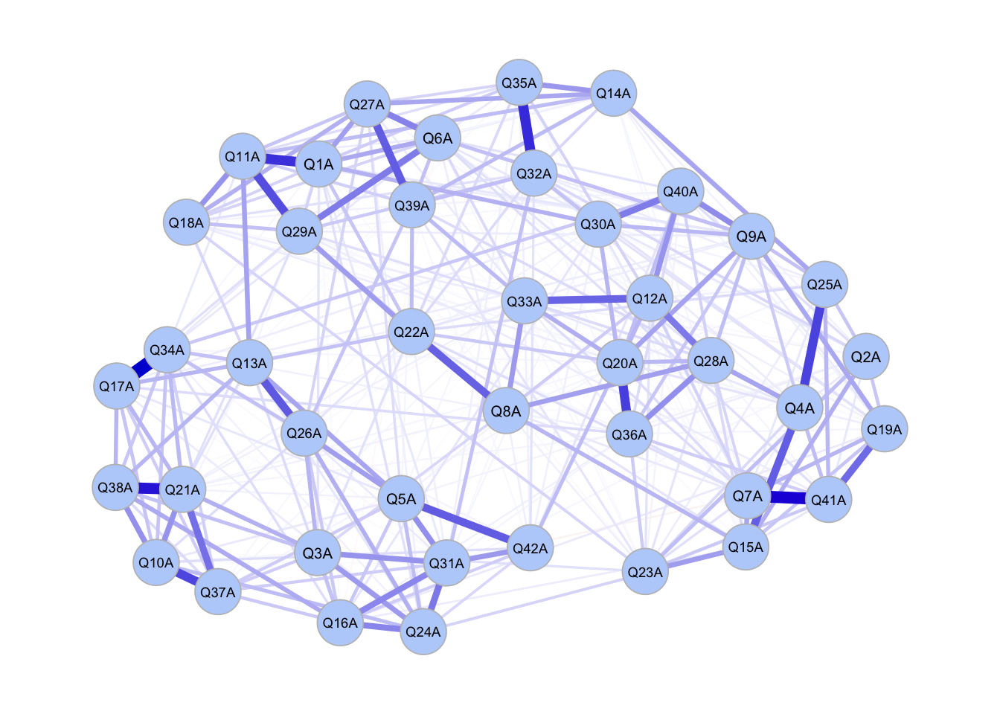


#### **Centrality Plots**

Measures of centrality include:

- strength: sum of absolute edge weigts connected to a vertex
- expected influence: sum of edge weigths connected to a vertex
- closeness: inverse of total distance for shortest paths connected to a vertex
- betweenness: the extent to which a vertex is in the shortest path between other vertexes
  
```{r}
# all centrality statistics
centralityTable(dassnet)
```


    ##       graph type node           measure         value
    ## 1   graph 1   NA  Q1A       Betweenness  0.3989850393
    ## 2   graph 1   NA  Q2A       Betweenness -0.4772174000
    ## 3   graph 1   NA  Q3A       Betweenness  0.3259681694
    ## ...
    ## 43  graph 1   NA  Q1A         Closeness  0.5966878702
    ## 44  graph 1   NA  Q2A         Closeness -1.0280604358
    ## 45  graph 1   NA  Q3A         Closeness -0.1993776784
    ## ...
    ## 85  graph 1   NA  Q1A          Strength  1.2275549301
    ## 86  graph 1   NA  Q2A          Strength -2.5113802362
    ## 87  graph 1   NA  Q3A          Strength  0.2007305777
    ## ...
    ## 127 graph 1   NA  Q1A ExpectedInfluence  1.2286290550
    ## 128 graph 1   NA  Q2A ExpectedInfluence -2.5074322594
    ## 129 graph 1   NA  Q3A ExpectedInfluence  0.2025939490
    ## ...


Strength 

```r
centralityPlot(dassnetplot, include ="Strength", orderBy = "Strength")
```

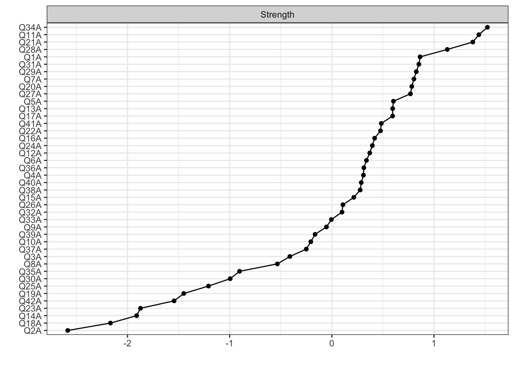

Expected Influence

```r
centralityPlot(dassnetplot, include ="ExpectedInfluence", orderBy = "ExpectedInfluence")
```
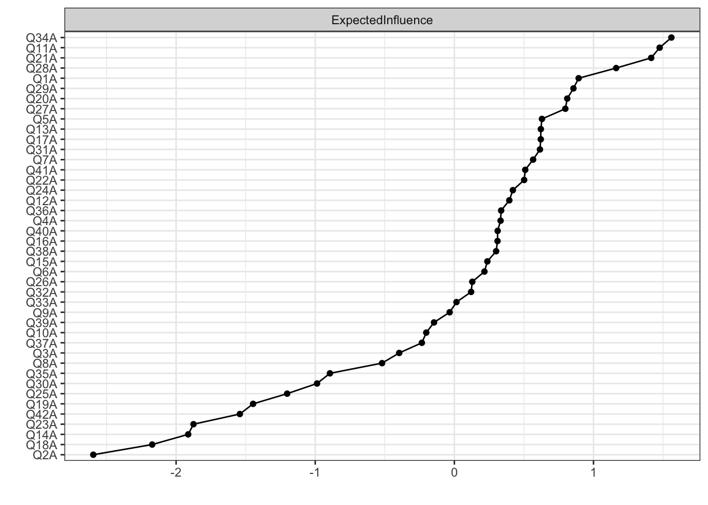

Closeness

```r
centralityPlot(dassnetplot, include ="Closeness", orderBy = "Closeness")
```

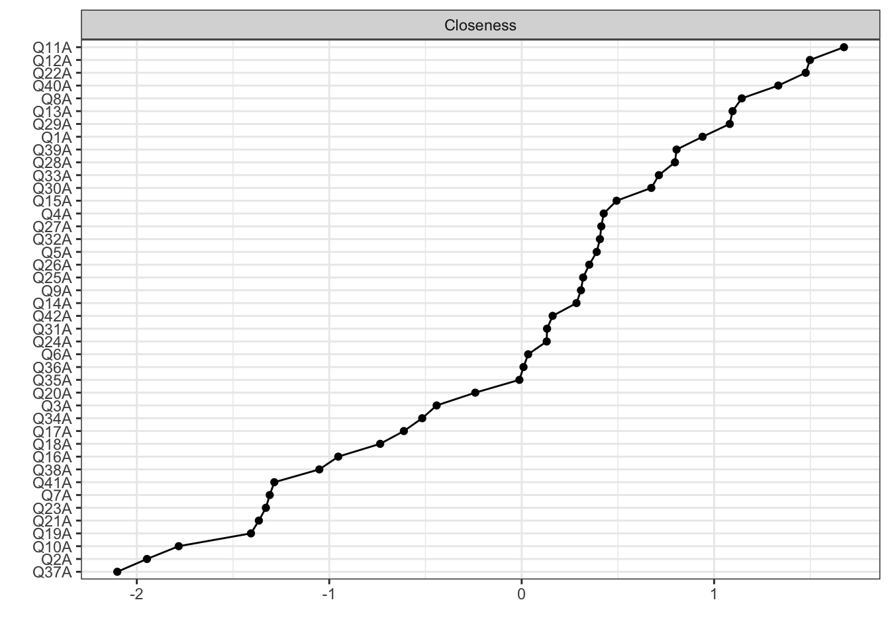

Betweenness

```r
centralityPlot(dassnetplot, include ="Betweenness", orderBy = "Betweenness")
```

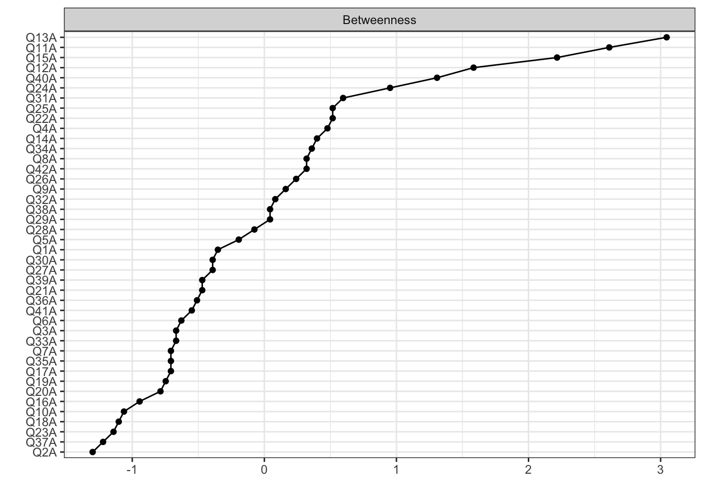


#### **Network Stability and Node/Edge Difference**

Bootnet stability indicates accuracy of a network. Stability of each of the centrality measures as well as of edges are shown below.

```r
# bootnet for corstability, nCores depend on divice, boots is recommended to be >= 1000
corboot <- bootnet(dassnet, boots=1000, nCores=1, type="case", statistics=c("strength", "expectedInfluence", "betweenness", "closeness", "edge"))

# corstability
corStability(corboot) 
```

    ## === Correlation Stability Analysis === 
    ## Sampling levels tested:
    ## Maximum drop proportions to retain correlation of 0.7 in at least 95% of the samples:
    ## betweenness: 0.128 
    ## - For more accuracy, run bootnet(..., caseMin = 0.05, caseMax = 0.206) 
    ## closeness: 0.206 
    ## - For more accuracy, run bootnet(..., caseMin = 0.128, caseMax = 0.284) 
    ## edge: 0.672  
    ## - For more accuracy, run bootnet(..., caseMin = 0.594, caseMax = 0.75) 
    ## expectedInfluence: 0.672 
    ## - For more accuracy, run bootnet(..., caseMin = 0.594, caseMax = 0.75) 
    ## strength: 0.672 
    ## - For more accuracy, run bootnet(..., caseMin = 0.594, caseMax = 0.75) 
    ## Accuracy can also be increased by increasing both 'nBoots' and 'caseN'.
    

Bootnet can also be used to see if centralities or edge weights of one node are significantly different from other nodes.
In the following graphs, black means two vertexes are differnt (sig. level = 0.05) whereas gray means not significant.

```r
# bootnet for node/edge difference, nCores depend on divice, boots is recommended to be >= 1000
diffboot <- bootnet(dassnet, boots=1000, nCores=1, statistics=c("strength", "expectedInfluence", "betweenness", "closeness", "edge"))

# strength centrality difference
plot(diffboot, "strength", order="sample", labels=T) 

# EI centrality difference
plot(diffboot, "expectedInfluence", order="sample", labels=T) 

# closeness centrality difference
plot(diffboot, "closeness", order="sample", labels=T) 

# betweenness centrality difference
plot(diffboot, "betweenness", order="sample", labels=T)

```

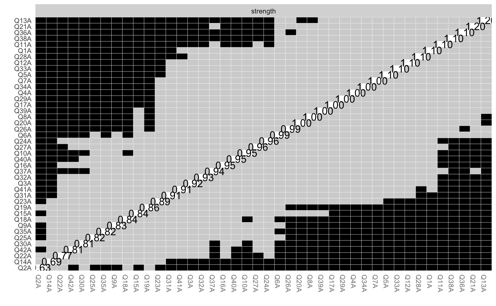
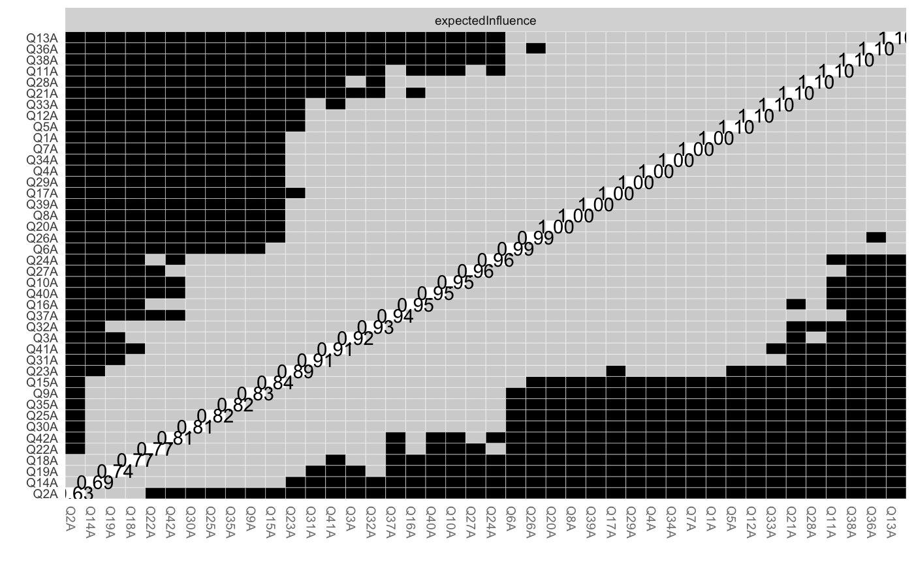
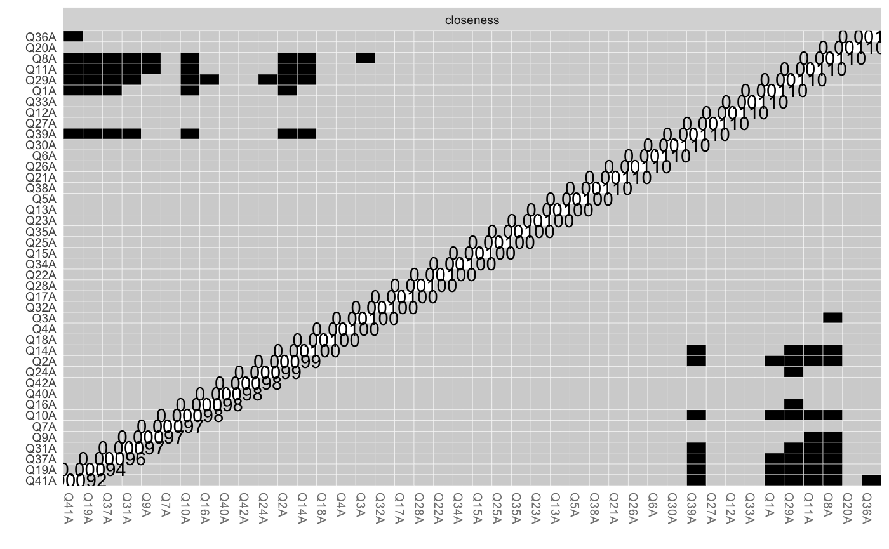
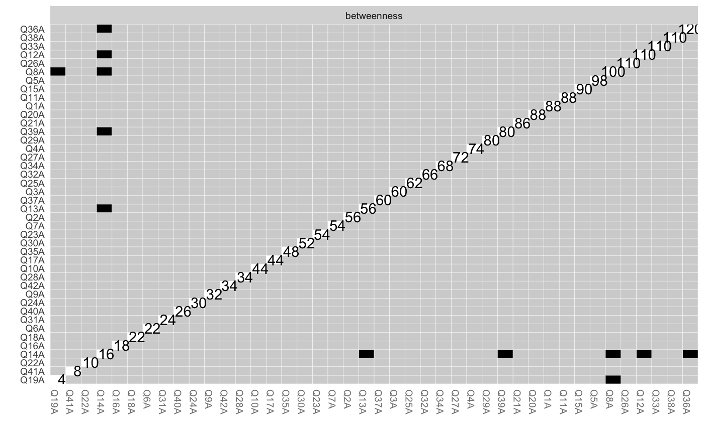


#### **Network bridges**

Suppose there are two clusters in a network, we can analyze how the two communities are connected. Among the DASS items, we can group anxiety and stress as one group, while using depression as the other group.

```r
library(networktools) # bridge

bridgegroups=list("depress"=c(3,5,10,13, 16, 17, 21, 24, 26, 31, 34, 37, 38, 42),"anxstress"=c(2,4,7,9,15,19,20,23,25,28,30,36,40,41,1,6,8,11,12,14,18,22,27,29,32,33,35,39)) 

bridgenet <- estimateNetwork(df, default="EBICglasso")

bridgeplot <-plot(bridgenet, layout="spring", vsize=5, border.color="gray",groups=bridgegroups, color=c("#e8b6fa", "yellow"), legend.cex=.4)
```
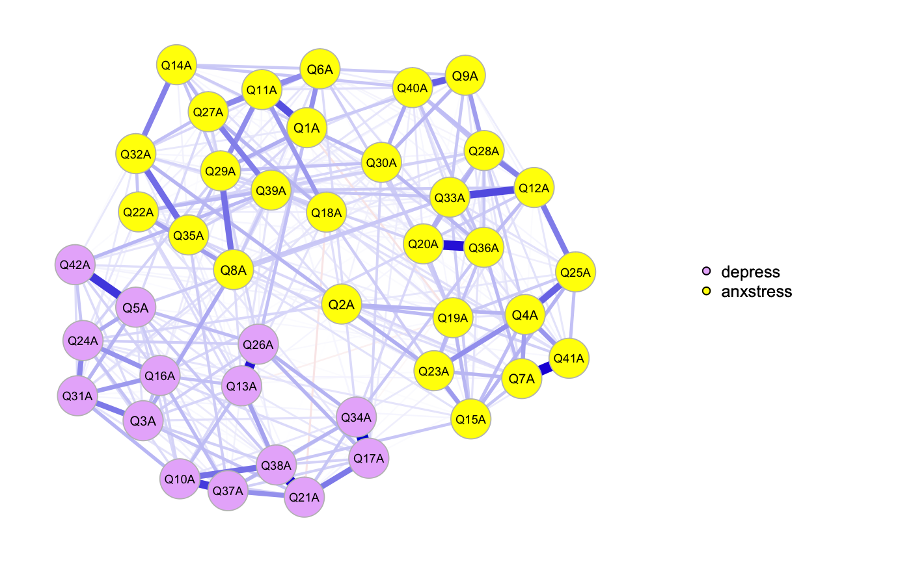


```r
# bridge val
brg <- bridge(bridgeplot, communities=c('2','2','1','2','1','2','2','2','2','1',
                              '2','2','1','2','2','1','1','2','2','2',
                              '1','2','2','1','2','1','2','2','2','2',
                              '1','2','2','1','2','2','1','1','2','2',
                              '2','2'), useCommunities = "all", directed = NULL, nodes = NULL)


plot(brg, include = "Bridge Strength", order="value")
plot(brg, include = "Bridge Betweenness", order="value")
plot(brg, include = "Bridge Closeness", order="value")
```

These plots show how connected each node in one community is to the other community using the centrality measures. The larger the bridge centrality values, the stronger this vertex is connected to the other community.

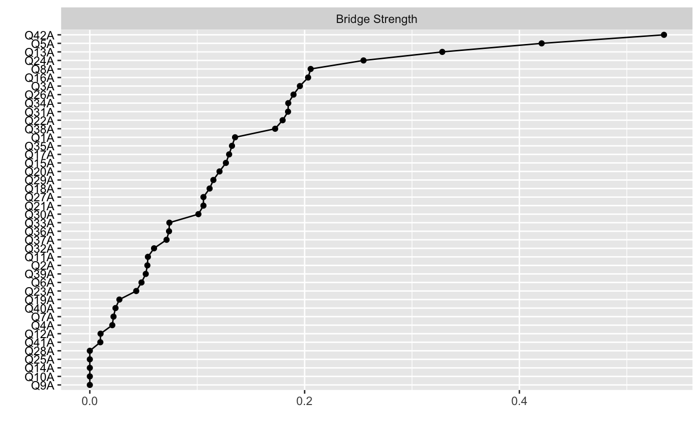
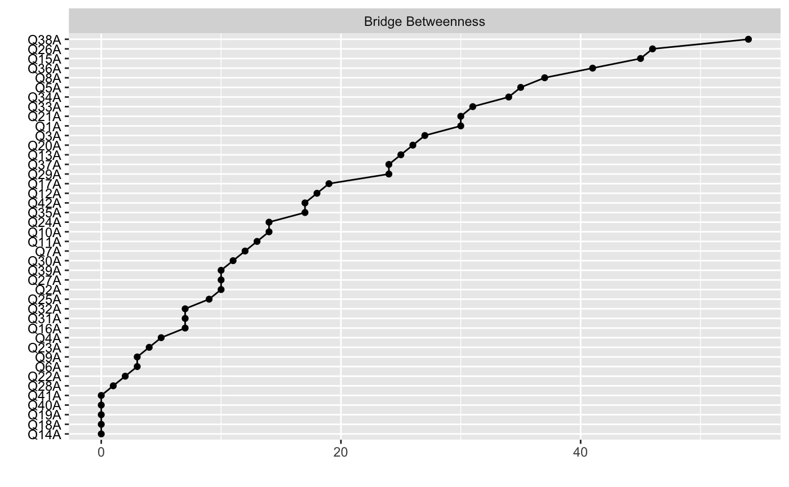
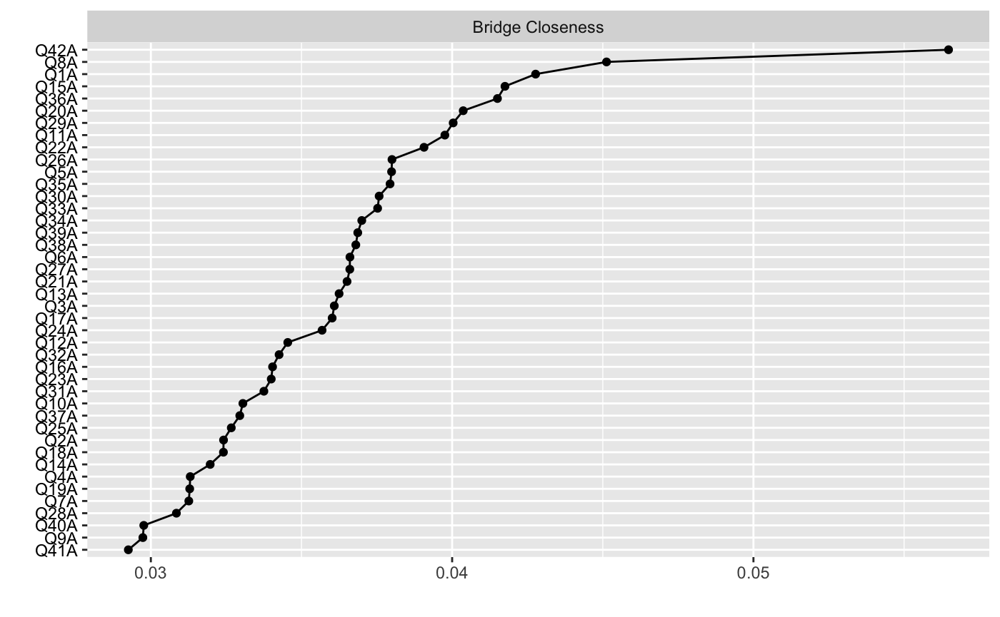

#### **Network Compatison**

We can also compare networks using network comparison test.

There are different levels of invariance, reference (here)[https://www.researchgate.net/publication/317493228_A_tutorial_on_R_package_NetworkComparisonTest_NCT]

- invariant network structure: are edges connecting vertexes different
- invariant edge strength: is edge between two specific vertexes different
- invariant global strength: is overal sum of strength different
- centrality invariance: does specific node have high/lower centrality than others

```r
library(NetworkComparisonTest)

df2_untruncated=dass[sample(nrow(dass), 500), ]
df2=df2_untruncated[,c("Q1A", "Q2A", "Q3A", "Q4A", "Q5A", "Q6A", "Q7A", "Q8A", "Q9A", "Q10A", "Q11A", "Q12A", "Q13A", "Q14A", "Q15A", "Q16A", "Q17A", "Q18A", "Q19A", "Q20A", "Q21A", "Q22A", "Q23A", "Q24A", "Q25A", "Q26A", "Q27A", "Q28A", "Q29A", "Q30A", "Q31A", "Q32A", "Q33A", "Q34A", "Q35A", "Q36A", "Q37A", "Q38A", "Q39A", "Q40A", "Q41A", "Q42A")]


dassnet2 <- estimateNetwork(df2, default="EBICglasso")

invariance <- NCT(dassnet, dassnet2, it=1000, weighted = T, test.edges = F,  edges='ALL')

summary(invariance)
```

    ## NETWORK INVARIANCE TEST
    ##      Test statistic M:  0.1557714 
    ## p-value 0.625 
    ##
    ## GLOBAL STRENGTH INVARIANCE TEST
    ##      Global strength per group:  20.17878 20.02639 
    ### Test statistic S:  0.1523897 
    ## p-value 0.311 
    ##
    ## EDGE INVARIANCE TEST
    ##      Edges tested:  
    ## Test statistic E:  
    ## p-value 
    ##
    ## CENTRALITY INVARIANCE TEST
    ##      Nodes tested: 
    ## Centralities tested: 
    ## Test statistic C:   
    ## p-value 

p-values below .5 indicates that invariance can be rejected. In this test, since I just compared two random samples from a common population, network invariance and global strength invaraince cannot be rejected and there is no need to further test edge invariance and centrality invariance.