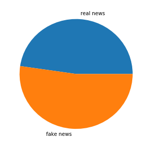
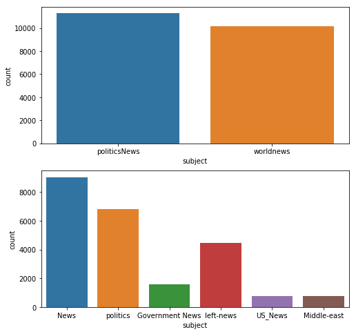
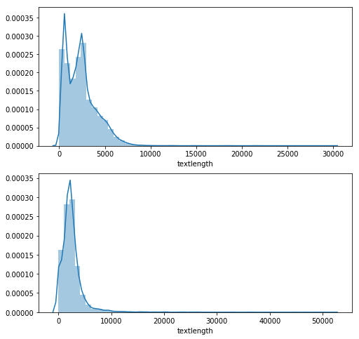
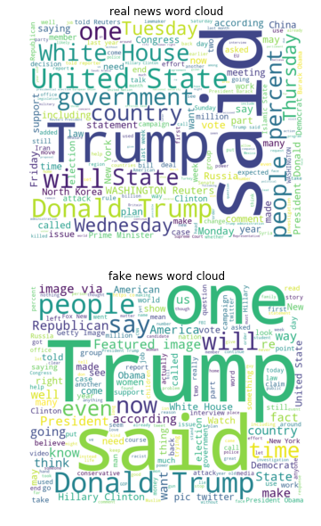
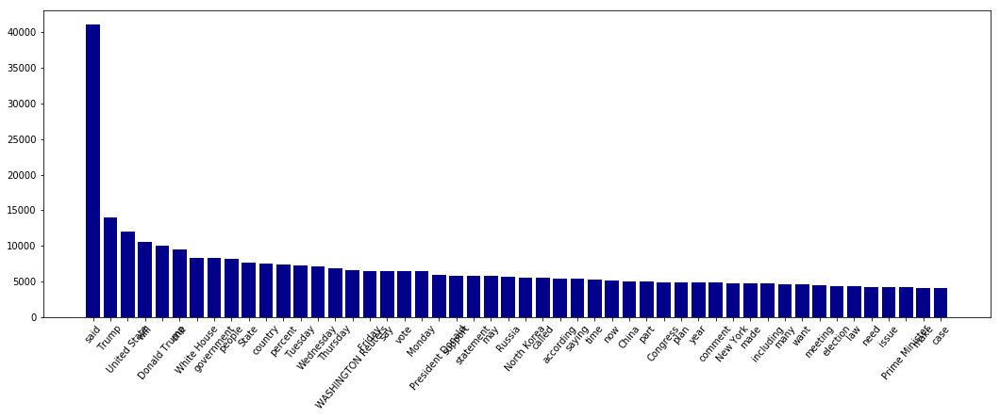
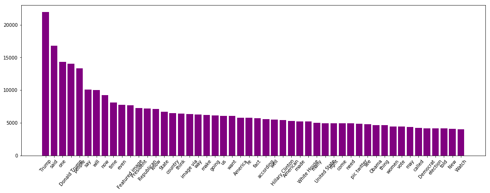
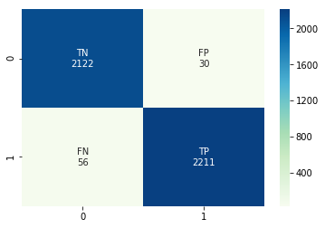
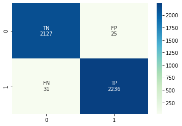

The code and formal latex report of this project can be found on this [github link](https://github.com/iasnobmatsu/COMP-562-Final-Project).

#### **Introduction**

Fake news is news or stories created to deliberately misinform or deceive readers. Usually, these stories are created to either influence people’s views, push a political agenda or cause confusion and can often be a profitable business for online publishers. They might also be satire/parody sources such as The Onion that was created as a form of entertainment.(Brodie, 2018) 

False information can deceive people by looking like trusted websites or using similar names and web addresses to reputable news organisations.(University of Michigan Library, 2020) Thus, it is important for us be able to identify the truthfulness, accuracy, and authenticity of the news and associated information.

Previous studies have attempted to use machine learning algorithms to distinguish fake news from real ones. Researchers have used Logistic Regressions, Naive Bayes algorithms, Support Vector Machines, and Decision Trees to classify news (Katsaros et al., 2019; Granik et al., 2017). Different types of artificial neural networks including Long Short-Term Memory (LSTM) Recurrent Neural Networks, Convolutional Neural Networks, and Adversarial Neural Networks were also widely used in fake information detection tasks (Bahad et al., 2019; Wang et al., 2018; Yang et al., 2018).

This variety of available algorithms for information identification has lead to a new question: what is the "best" way of fake news identification? Our project was designed to address this need and to explore the effectiveness of different machine learning methods on news classification. Taken together, we aim to compare the performance of Logistic Regression, Naive Bayes, Support Vector Machine, and LSTM neural network in fake news classification, via evaluating their accuracy and the confusion matrices corespondent to each algorithm.


```python
# install wordcloud, a little tricky
# import sys
# print(sys.executable)
# !/anaconda3/bin/python -m pip install wordcloud
```

#### **Import libraries needed, initial look at datasets**


```python
import pandas as pd
import numpy as np
import matplotlib.pyplot as plt
import seaborn as sns
import re
import string

from sklearn.feature_extraction.text import TfidfVectorizer
from sklearn import feature_extraction
from sklearn.model_selection import train_test_split
from sklearn.linear_model import LogisticRegression
from sklearn.naive_bayes import MultinomialNB
from sklearn.model_selection import train_test_split
from sklearn.metrics import confusion_matrix


from keras.preprocessing.text import Tokenizer
from keras.preprocessing.sequence import pad_sequences
from keras.models import Sequential
from keras.layers import LSTM,Dense,Dropout,Embedding
from keras.initializers import Constant
from keras.optimizers import Adam


from nltk.stem.porter import PorterStemmer
from nltk.corpus import stopwords
from wordcloud import WordCloud

```

    Using TensorFlow backend.


```python
fake=pd.read_csv('data/Fake.csv')
fake.head()
```


<div>
<style scoped>
    .dataframe tbody tr th:only-of-type {
        vertical-align: middle;
    }

    .dataframe tbody tr th {
        vertical-align: top;
    }

    .dataframe thead th {
        text-align: right;
    }
</style>
<table border="1" class="dataframe">
  <thead>
    <tr style="text-align: right;">
      <th></th>
      <th>title</th>
      <th>text</th>
      <th>subject</th>
      <th>date</th>
    </tr>
  </thead>
  <tbody>
    <tr>
      <th>0</th>
      <td>Donald Trump Sends Out Embarrassing New Year’...</td>
      <td>Donald Trump just couldn t wish all Americans ...</td>
      <td>News</td>
      <td>December 31, 2017</td>
    </tr>
    <tr>
      <th>1</th>
      <td>Drunk Bragging Trump Staffer Started Russian ...</td>
      <td>House Intelligence Committee Chairman Devin Nu...</td>
      <td>News</td>
      <td>December 31, 2017</td>
    </tr>
    <tr>
      <th>2</th>
      <td>Sheriff David Clarke Becomes An Internet Joke...</td>
      <td>On Friday, it was revealed that former Milwauk...</td>
      <td>News</td>
      <td>December 30, 2017</td>
    </tr>
    <tr>
      <th>3</th>
      <td>Trump Is So Obsessed He Even Has Obama’s Name...</td>
      <td>On Christmas day, Donald Trump announced that ...</td>
      <td>News</td>
      <td>December 29, 2017</td>
    </tr>
    <tr>
      <th>4</th>
      <td>Pope Francis Just Called Out Donald Trump Dur...</td>
      <td>Pope Francis used his annual Christmas Day mes...</td>
      <td>News</td>
      <td>December 25, 2017</td>
    </tr>
  </tbody>
</table>
</div>


```python
real=pd.read_csv('data/True.csv')
real.head()
```


<div>
<style scoped>
    .dataframe tbody tr th:only-of-type {
        vertical-align: middle;
    }

    .dataframe tbody tr th {
        vertical-align: top;
    }

    .dataframe thead th {
        text-align: right;
    }
</style>
<table border="1" class="dataframe">
  <thead>
    <tr style="text-align: right;">
      <th></th>
      <th>title</th>
      <th>text</th>
      <th>subject</th>
      <th>date</th>
    </tr>
  </thead>
  <tbody>
    <tr>
      <th>0</th>
      <td>As U.S. budget fight looms, Republicans flip t...</td>
      <td>WASHINGTON (Reuters) - The head of a conservat...</td>
      <td>politicsNews</td>
      <td>December 31, 2017</td>
    </tr>
    <tr>
      <th>1</th>
      <td>U.S. military to accept transgender recruits o...</td>
      <td>WASHINGTON (Reuters) - Transgender people will...</td>
      <td>politicsNews</td>
      <td>December 29, 2017</td>
    </tr>
    <tr>
      <th>2</th>
      <td>Senior U.S. Republican senator: 'Let Mr. Muell...</td>
      <td>WASHINGTON (Reuters) - The special counsel inv...</td>
      <td>politicsNews</td>
      <td>December 31, 2017</td>
    </tr>
    <tr>
      <th>3</th>
      <td>FBI Russia probe helped by Australian diplomat...</td>
      <td>WASHINGTON (Reuters) - Trump campaign adviser ...</td>
      <td>politicsNews</td>
      <td>December 30, 2017</td>
    </tr>
    <tr>
      <th>4</th>
      <td>Trump wants Postal Service to charge 'much mor...</td>
      <td>SEATTLE/WASHINGTON (Reuters) - President Donal...</td>
      <td>politicsNews</td>
      <td>December 29, 2017</td>
    </tr>
  </tbody>
</table>
</div>


#### **Exploratory Data Analysis**

The true dataset contains 21417 observations; the fake dataset contains 23481 observations


```python
plt.figure(figsize=(5,5)) 
plt.pie([real.shape[0], fake.shape[0]],labels=['real news', 'fake news'], shadow=False)#pie chart
```


    ([<matplotlib.patches.Wedge at 0x12c944d30>,
      <matplotlib.patches.Wedge at 0x12c94d2b0>],
     [Text(0.0793629,1.09713,'real news'), Text(-0.0793628,-1.09713,'fake news')])





distribution of topics in fake/real news datasets


```python
fig,a =  plt.subplots(2,1, figsize=(8,8)) 
sns.countplot(x='subject', data=real, ax=a[0])
sns.countplot(x='subject', data=fake, ax=a[1])
```


    <matplotlib.axes._subplots.AxesSubplot at 0x12b4f1e10>





news text length distributions


```python
real['textlength']=real['text'].str.len()
fake['textlength']=fake['text'].str.len()


fig,a =  plt.subplots(2,1, figsize=(8,8)) 
sns.distplot(real['textlength'], ax=a[0])
sns.distplot(fake['textlength'], ax=a[1])

# real['textlength']
```


    <matplotlib.axes._subplots.AxesSubplot at 0x10b5ddbe0>





Word cloud of frequent appearing words in real vs fake news.

```python
# from wordcloud import WordCloud

alltextreal=' '.join(set([wd for wd in real['text']]))
alltextfake=' '.join(set([wd for wd in fake['text']]))


wc1 = WordCloud(background_color="white", max_words=200, width=1000, height=800).generate(alltextreal)
wc2 = WordCloud(background_color="white", max_words=200, width=1000, height=800).generate(alltextfake)


fig,a =  plt.subplots(2,1,figsize=(20,10))
a[0].imshow(wc1, interpolation='bilinear')
a[0].axis("off")
a[0].set_title('real news word cloud')

a[1].imshow(wc2, interpolation='bilinear')
a[1].axis("off")
a[1].set_title('fake news word cloud')
plt.show()
```





Get word frequencies according to the wordclouds, plot the top 50 frequent words


```python

prcessed=WordCloud().process_text(alltextreal)
sortedfreqreal={k: v for k, v in sorted(prcessed.items(), key=lambda item: -item[1])}
prcessed2=WordCloud().process_text(alltextfake)
sortedfreqfake={k: v for k, v in sorted(prcessed2.items(), key=lambda item: -item[1])}

```


```python
plt.figure(figsize=(18,6))
plt.xticks(rotation=50)
plt.bar(list(sortedfreqreal.keys())[:50],list(sortedfreqreal.values())[:50], color='darkblue')

```


    <BarContainer object of 50 artists>





```python
plt.figure(figsize=(18,6))
plt.xticks(rotation=50)
plt.bar(list(sortedfreqfake.keys())[:50],list(sortedfreqfake.values())[:50], color='purple')

```


    <BarContainer object of 50 artists>





#### **Preprocessing**

data cleaning

- remove tagging people (@kdhefjw)
- remove url
- remove things that are not exactly url but contain slash (pic.twitter.com/wiQSQNNzw0)
- remove (Rueters) which would indicate real news
- remove punctuations
- remove digits
- remove stop words
- stem words


```python
# remove punctuation, stopwords

stemmer=PorterStemmer()
def clean(text):
    if "(Reuters)" in text: # real news contains this identifier sometimes
        text=text.split("(Reuters)")[1]
    text=re.sub(r'@[^s]*', '', text)
    text=re.sub(r'https?://\S+|www\.\S+', '', text)
    text=" ".join([wd for wd in text.split() if "\\" not in wd and "/" not in wd and wd not in stopwords.words('english')])
    text="".join([c for c in text if c not in string.punctuation])
    text="".join([c for c in text if not c.isdigit()])
    text=re.sub('[^a-zA-z\s]', '', text)
    text=text.lower()
    text=" ".join([stemmer.stem(wd) for wd in text.split()])
    return text


print(clean(real["text"][43]))
real["text"][43]
```

    the us hous repres thursday approv billion bill help widespread recoveri effort hurrican wildfir year by vote hous pass measur help puerto rico us virgin island state rebuild follow natur disast the bill goe senat expect approv week


    'WASHINGTON (Reuters) - The U.S. House of Representatives on Thursday approved an $81 billion bill to help widespread recovery efforts from hurricanes and wildfires this year. By a vote of 251-169, the House passed the measure to help Puerto Rico, the U.S. Virgin Islands and states rebuild following the natural disasters. The bill now goes to the Senate where it is expected to be approved this week. '


cleaning data


```python
real["isfake"]=0
fake["isfake"]=1

allnews=pd.concat([real, fake])

# takes about 2 hours to clean this dataset, use the already cleaned file instead of running this every time 
# allnews['text']=allnews['text'].apply(lambda text: clean(text))
# pd.DataFrame.to_csv(allnews, "cleaned_news_text.csv", index=False)

```


```python
cleanedtext=pd.read_csv("data/cleaned_news_text.csv")
print(cleanedtext['text'][1000])

print(cleanedtext['text'][40000])
```

    presid bashar alassad famili role futur syria us secretari state rex tillerson said thursday ahead peac talk aim polit transit schedul resum next month tillerson said trump administr back geneva peac talk way end sixyearold war move polit transit elect he speak hold talk un special envoy syria staffan de mistura announc stall peac talk syrian govern stilltobeunit opposit would resum geneva nov the unit state want whole unifi syria role bashar alassad govern tillerson told report swiss citi end weeklong trip took saudi arabia qatar pakistan india it view i said mani time well believ futur assad regim assad famili the reign assad famili come end the issu brought about when trump administr came offic took view not prerequisit assad goe transit process start ad support russian air power iranback militia assad appear militarili unassail last month assad alli hezbollah declar victori syrian war those forc push islam state back larg swath eastern syria recent month past year taken numer pocket rebelheld territori around aleppo hom damascu my read assad stay long russian iranian altern him western diplomat told reuter the date departur depend russian anyon els onc find someon better may go ceasefir deal broker russia turkey iran unit state remain rebelheld area western syria freed manpow assad alli tillerson call discuss de mistura fruit said unit state continu effort deescal violenc syria he said reason assad forc succeed turn tide war islam state milit air support receiv russia tillerson said iran assad main alli seen made differ defeat islam state syria i see syria triumph iran i see iran hangeron i dont think iran given credit defeat isi islam state in syria rather i think taken advantag situat
    a shock new video releas center medic progress undercov investig group releas video show plan parenthood affili profit sell bodi part abort babiesthi latest video preview footag cmp investig gather nation abort feder convent attend hundr member abort industri year the naf major trade group north american abort provid plan parenthood make percent member leadershipnotic audienc laugh vile comment ever heard kill dismemb babi womb horrifi remark brandnew undercov footag attende made comment offici present other directli undercov cmp investigatorsdr lisa harri medic director plan parenthood michigan given actual see fetu way given might actual agre violenc here let give violenc person kill let give thatdr ann schuttain director abort servic plan parenthood gulf coast which refer local lawenforc crimin charg relat fetaltissu traffick if i procedur i see i fear come umbilicu navel i might ask second set forcep hold bodi cervix pull leg two pba partialbirth abortiondr staci delin director abort servic plan parenthood new york citi but certainli intact de dilat extract otherwis known partialbirth abort method illeg feder lawdr uta landi founder consortium abort provid cap plan parenthood feder america ppfa an eyebal fell lap gross laughter crowdtalcott camp deputi director aclu reproduct health freedom project i like oh god i get it when skull broken realli sharp i get it i understand peopl talk get skull out calvarium dr susan robinson abort provid plan parenthood mar mont the fetu tough littl object take apart i mean take apart day one difficult you go there go am i get uteru fetu oh good fetu robinson make stab sound effect what i got noth let tri again below comment footag provid evid plan parenthood involv illeg profit fetaltissu traffickingdr lesli drummond abort provid plan parenthood mar mont a ppfa affili contract biotech firm paid per fetal organ provid i get lot ooh ahh stemexpress biotech firm you know want liver last week i sacramento said i need four intact limb and i said want whatthi part video dispel doubt american plan parenthood sell babi part profitdr staci delin director abort servic plan parenthood nyc but i think financi incent guy cmp investig pose tissu buyer go like peopl get approv happi it dr paul blumenth former medic director pp maryland i know plan parenthood sell lot stuff fetal organ peopl both naf plan parenthood sought obtain preliminari injunct center medic progress prevent releas undercov video that civil suit current appeal but california attorney gener took matter hand late march charg cmp investig david daleiden sandra merritt feloni count illeg record confidenti commun the state refus name accus crimin case even though daleiden merritt charg publiclyread at nation review


```python
X_train, X_test, y_train, y_test = train_test_split(cleanedtext.dropna()['text'],cleanedtext.dropna()['isfake'],test_size=0.1, random_state=10)#set random state

```


```python
X_train.shape
```


    (39764,)


```python
X_test.shape
```


    (4419,)


```python

vtz=TfidfVectorizer()
X_train=vtz.fit_transform(X_train)
X_test=vtz.transform(X_test)
```


```python
# print(vtz.get_feature_names()[:10])
# print(vec.toarray()[:10])
print(len(vtz.get_feature_names()))
print(X_train.shape)
print(X_test.shape)
print(cleanedtext.dropna().shape)


```

    157664
    (39764, 157664)
    (4419, 157664)
    (44183, 6)


#### **Models**

Logistic regression

Logistic Regression is widely used for binary classification problems. Logistic Regression uses the sigmoid function, $sigmoid(z)=  \frac{1}{1+e^{z}}$, to convert linear relationships into binary cases using $y=\frac{1}{1+e^{-(b+w_1x_1+w_2x_2...)}}$. 

TFIDF transformation gave us 157664 features from the training set news text, and with these features, the Logistic Regression classifier predicts the testing set with an accuracy of 98.05%.


```python
lr = LogisticRegression()
lr.fit(X_train, y_train) 
print(lr.score(X_test, y_test))
lr_pred=lr.predict(X_test)
lrcm=confusion_matrix(y_test,lr_pred)
print(lrcm)

# https://medium.com/@dtuk81/confusion-matrix-visualization-fc31e3f30fea
group_names = ['TN','FP','FN','TP']
group_counts = ['{0:0.0f}'.format(value) for value in lrcm.flatten()]
labels = [f'{v1}\n{v2}' for v1, v2 in zip(group_names,group_counts)]
labels = np.asarray(labels).reshape(2,2)
sns.heatmap(lrcm, annot=labels, fmt='', cmap="GnBu")

```

    0.9805385833899072
    [[2122   30]
     [  56 2211]]


    <matplotlib.axes._subplots.AxesSubplot at 0x1765b3f60>





naive bayes

Bayes' Rule states that $P(A&#124;B)=\frac{P(B&#124;A)P(A)}{P(B)}$. Naive Bayes applies Bayes's rule to a chain of features with the assumption that the probability of each feature is independent. There are different types of Naive Bayes classifiers that are based on different distributions such as Bernoulli, Gaussian, and Multinomial. Although the TFIDF encoding we used generates float-point data, Gaussian Naive Bayes classifier cannot be used in our study because it requires a non-sparse input matrix. Thus, we chose to use the Multinomial Native Bayes classifier, which would work with TDIDF data even though discrete encoding would be more ideal. 

After training with 157664 features, the Multinomial Native Bayes classifier predicts the testing set with an accuracy of 93.32%.


```python

nb = MultinomialNB()
nb.fit(X_train, y_train)
nb_pred=nb.predict(X_test)
print(nb.score(X_test, y_test))
nb_cm=confusion_matrix(y_test,nb_pred)
print(nb_cm)

# https://medium.com/@dtuk81/confusion-matrix-visualization-fc31e3f30fea
group_names = ['TN','FP','FN','TP']
group_counts = ['{0:0.0f}'.format(value) for value in nb_cm.flatten()]
labels = [f'{v1}\n{v2}' for v1, v2 in zip(group_names,group_counts)]
labels = np.asarray(labels).reshape(2,2)
sns.heatmap(nb_cm, annot=labels, fmt='', cmap="GnBu")

```

    0.9332428151165422
    [[2020  132]
     [ 163 2104]]


    <matplotlib.axes._subplots.AxesSubplot at 0x7fc5aaf16c10>


SVM

Support Vector Machine (SVM) is another supervised machine learning algorithm often used for classification tasks. Unlike Logistic Regression, SVM uses the orthogonal distances from the decision boundary that separates different labels to the data points near the boundary to decided how to optimize the classification task. 

After training with 157664 features, the SVM classifier predicts the testing set with an accuracy of 98.23%.


```python
from sklearn.linear_model import SGDClassifier

svm = SGDClassifier()
svm.fit(X_train, y_train)
svm_pred=svm.predict(X_test)
print(svm.score(X_test, y_test))
svm_cm=confusion_matrix(y_test,svm_pred)
print(svm_cm)

# https://medium.com/@dtuk81/confusion-matrix-visualization-fc31e3f30fea
group_names = ['TN','FP','FN','TP']
group_counts = ['{0:0.0f}'.format(value) for value in svm_cm.flatten()]
labels = [f'{v1}\n{v2}' for v1, v2 in zip(group_names,group_counts)]
labels = np.asarray(labels).reshape(2,2)
sns.heatmap(svm_cm, annot=labels, fmt='', cmap="GnBu")
```

    0.9823489477257298
    [[2127   25]
     [  53 2214]]


    <matplotlib.axes._subplots.AxesSubplot at 0x7fc5a943d810>


LSTM

We also used a bi-directional LSTM recurrent neural network suggested by Bahad et al. (2019) for text classification of real versus fake news. Bi-directional LSTM is a form of generative learning algorithm that connects hidden layers of two opposite directions as an attempt to connect what comes later with what comes before (Schuster \& Paliwal, 1997). This is particularly useful in natural language processing such as text classification tasks because what comes later in a sentence may need to be combined with what comes earlier in a sentence to make sense.


```python
X_train, X_test, y_train, y_test = train_test_split(cleanedtext.dropna()['text'],cleanedtext.dropna()['isfake'],test_size=0.1, random_state=10)#set random state

```


```python
tkn = Tokenizer()
tkn.fit_on_texts(X_train.values)
X_train = tkn.texts_to_sequences(X_train.values)
X_train = pad_sequences(X_train)
X_test = tkn.texts_to_sequences(X_test.values)
X_test = pad_sequences(X_test)


```


```python
print(X_train.shape, y_train.shape)
```

    (39764, 5022) (39764,)


```python

from keras.layers import Bidirectional
model = Sequential()
# tf.keras.layers.Embedding(
#     input_dim,
#     output_dim,
#     input_length=None,
# )
model.add(Embedding(len(tkn.word_index) + 1, 256, input_length = X_train.shape[1]))
model.add(Bidirectional(LSTM(128)))
model.add(Dropout(0.2)) #drop out to try avoid overfitting with too many hidden units
model.add(Dense(64, activation = 'relu'))
model.add(Dense(1,activation='sigmoid')) # final layer activation is sigmoid becuase classifying 1/0
model.compile(loss = 'binary_crossentropy', optimizer='adam',metrics = ['accuracy'])
print(model.summary())


```

    Model: "sequential"
    _________________________________________________________________
    Layer (type)                 Output Shape              Param #   
    =================================================================
    embedding (Embedding)        (None, 5022, 256)         40368896  
    _________________________________________________________________
    bidirectional (Bidirectional (None, 256)               394240    
    _________________________________________________________________
    dropout (Dropout)            (None, 256)               0         
    _________________________________________________________________
    dense (Dense)                (None, 64)                16448     
    _________________________________________________________________
    dense_1 (Dense)              (None, 1)                 65        
    =================================================================
    Total params: 40,779,649
    Trainable params: 40,779,649
    Non-trainable params: 0
    _________________________________________________________________
    None


```python
model.fit(X_train, y_train, epochs=5, batch_size=128)
```

    Epoch 1/5
    311/311 [==============================] - 504s 2s/step - loss: 0.1126 - accuracy: 0.9553
    Epoch 2/5
    311/311 [==============================] - 505s 2s/step - loss: 0.0346 - accuracy: 0.9890
    Epoch 3/5
    311/311 [==============================] - 499s 2s/step - loss: 0.0397 - accuracy: 0.9877
    Epoch 4/5
    311/311 [==============================] - 499s 2s/step - loss: 0.0169 - accuracy: 0.9947
    Epoch 5/5
    311/311 [==============================] - 498s 2s/step - loss: 0.0085 - accuracy: 0.9976


    <tensorflow.python.keras.callbacks.History at 0x7fc58da6dfd0>


```python

score, acc = model.evaluate(X_test, y_test,batch_size=128)
print('accuracy:', acc)
```

    35/35 [==============================] - 13s 381ms/step - loss: 0.0456 - accuracy: 0.9873
    accuracy: 0.9873274564743042


```python
X=None
X_train=None
y_train=None
cleanedtext=None
pred=model.predict_classes(X_test)
print(pred[:20])
```

    [[1]
     [0]
     [1]
     [0]
     [1]
     [0]
     [0]
     [0]
     [0]
     [0]
     [0]
     [0]
     [1]
     [1]
     [1]
     [1]
     [0]
     [1]
     [0]
     [0]]


```python
lstm_cm=confusion_matrix(y_test,pred)
print(lstm_cm)

# https://medium.com/@dtuk81/confusion-matrix-visualization-fc31e3f30fea
group_names = ['TN','FP','FN','TP']
group_counts = ['{0:0.0f}'.format(value) for value in lstm_cm.flatten()]
labels = [f'{v1}\n{v2}' for v1, v2 in zip(group_names,group_counts)]
labels = np.asarray(labels).reshape(2,2)
sns.heatmap(lstm_cm, annot=labels, fmt='', cmap="GnBu")

```

    [[2127   25]
     [  31 2236]]


    <matplotlib.axes._subplots.AxesSubplot at 0x7fc0ce2119d0>





#### **Conclusions**

Comparing the models above, the Naive Bayes classifier has the lowest accuracy while the LSTM network has the highest accuracy. However, although Naive Bayes has the lowest accuracy, the score is still above 90%. On the other side, while LSTM has the highest score, LSTM's accuracy is only marginally better than Logistic Regression and SVM. This being said, running more epochs during the training phase of LSTM may further increase the score. Admittedly though, LSTM is significantly more computationally expensive than the other algorithms, so the decision of which model to use may depend on both what accuracy level is needed and what computational power and time requirements are present. 

Another thing to note is that although LSTM's accuracy is only slightly higher than the other machine learning models used in this project, we did train the LSTM model using much fewer features. The Logistic Regression, Support Vector Machine, and Naive Bayes had 157664 features to train on, whereas for the LSTM model, we only used 5022 features for training.

In conclusion, the machine learning algorithms we employed are relatively accurate in classifying fake news by text content analysis. There exists a difference in computational time among different methods. The difference in accuracy and running time are fully discussed in the discussion section. However, due to the lengthy nature of news contents, we find content analyzing extremely time-consuming, both in computation and training time. This might largely influence the efficiency of information identification. A solution to this problem might be an identification algorithm that focus on analyzing the title or summary of the news. Future work could be done on title-focused news classification, for the purpose of increasing computationally efficiency.


#### **Acknowledgements**
We thank the following kaggle kernels for guiding us through the natural language processing tasks:

- https://www.kaggle.com/parulpandey/getting-started-with-nlp-a-general-intro
- https://www.kaggle.com/nasirkhalid24/unsupervised-k-means-clustering-fake-news-87
- https://www.kaggle.com/muhammadshahzadkhan/is-it-real-news-nlp-lstm-acc-99-9#Now-we-need-to-apply-padding-to-make-sure-that-all-the-sequences-have-same-length


#### **References**

[1] Ahmed, H., Traore, I., & Saad, S. (2018).Detecting opinion spams and fake news using text classification. Security and Privacy, 1 (1), e9.

[2] Bahad, P., Saxena, P., & Kamal, R. (2019). Fake News Detection using Bi-directional LSTMRecurrent Neural Network. Procedia Computer Science, 165, 74-82.


[3] Brodie, I. (2018). Pretend news, false news, fake news: The onion as put-on, prank, and legend. Journal of American Folklore, 131 (522), 451-459.

[4] Granik, M., & Mesyura, V. (2017, May). Fake news detection using naive Bayes classifier. In 2017 IEEE First Ukraine Conference on Electrical and Computer Engineering (UKRCON) (pp.900-903). IEEE.

[5] Katsaros, D., Stavropoulos, G., & Papakostas, D. (2019, October). Which machine learning paradigm for fake news detection?. In 2019 IEEE/WIC/ACMInternational Conference on Web Intelligence (WI) (pp. 383-387). IEEE.

[6] Research Guides. (2020, June 24). Retrieved November 19, 2020, from https://guides.lib.umich.e du/fakenews.

[7] Schuster, M., & Paliwal, K. K. (1997). Bidirectional recurrent neural networks. IEEE transactions on Signal Processing, 45 (11), 2673-2681.

[8] Wang, Y., Ma, F., Jin, Z., Yuan, Y., Xun, G., Jha, K., ... & Gao, J. (2018, July). Eann: Event adversarial neural networks for multimodal fake news detection. In Proceedings of the 24th acm sigkdd international conference on knowledge discovery data mining (pp. 849-857).

[9] Yang, Y., Zheng, L., Zhang, J., Cui, Q., Li, Z., & Yu, P. S. (2018). TI-CNN: Convolutional neural networks for fake news detection. arXiv preprint arXiv:1806.00749.


