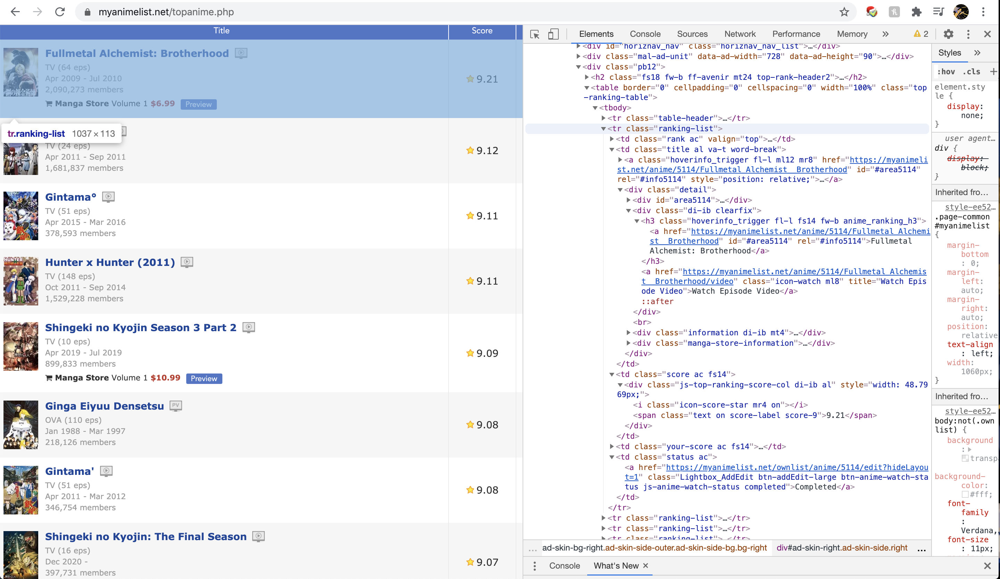
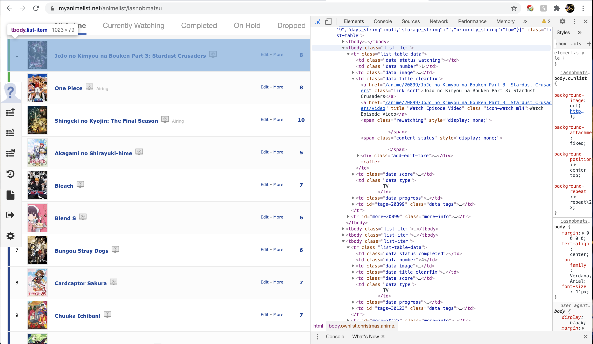

Disclaimer: The following code for scraping MAL was written on Dec 30th, 2020. The code is not garanteed to work if after the stated time, website structures for MAL changed. I will make an effort to update the code as often as possible. However, I did find being able to write the following code allows me to scrape most websites I want. 

To downlaod the ipynb (python jupyter notebook) script I wrote for this post, please click [here](../html_assets/MALscrape/MALscrapper.ipynb).

To download the MAL top 3000 anime list csv file (collected Dec 29, 2020), please click [here](../html_assets/MALscrape/MALtop3000.csv).

To download my own MAL anime list csv file (collected Dec 30, 2020), please click [here](../html_assets/MALscrape/iasnobmatsuMAL.csv).

### Scraping Static HTML: Using MAL Top Animes as An Example

#### Import libraries

- BeautifulSoup: for scraping
- requests: request html and parse
- re: regular expression for string manipulation
- pandas: convert data scraped into csv files


```python
from bs4 import BeautifulSoup 
import requests
import re
import pandas as pd
```

#### Helper Function to Parse One Anime Row



Looking at the html of [https://myanimelist.net/topanime.php](https://myanimelist.net/topanime.php) (using chrome, right click and select inspect, navigate to the element section, and you will see the HTML), each anime is a tr (table row) of the table. Within each row, name of anime is wrapped in class anime_ranking_h3, related information in class information, and score in class score. These can be scraped with beautifulsoup rather simply using the select() function. Then the text can be cleaned.

We can further get a show's start year and end year from the related information section. Here I used regular expression to get 4 digits of year to match start and end years.


```python
def getOneRow(targetrow):
    animeTitle=targetrow.select("h3.anime_ranking_h3")[0].text
    animeInformation=targetrow.select("div.information")[0].text.replace("\n","|").replace("  ","")

    animeScore=targetrow.select("td.score")[0].text.replace("\n", "")
    # split by |
    year=animeInformation.split("|") 
    # get all years in the second section from above
    years=re.findall('[0-9]+', year[2])
    start="NA"
    end="NA"
    
    if len(year)>0:
        start=years[0]
        if len(years)>1:
            end=years[1]
    return animeTitle, animeInformation,animeScore, start, end

# tablerow[0]
```

#### Function to Get a Specified Number of Anime on The Top Anime List

Pass in the url into requests.get() function to get the entire page, then make a soup out of it with BeautifulSoup. With the soup ready, we could find the table corresponding to the top anime list and find all its rows. For each row, get desired data with the getOneRow() helper function. Because each page of the top anime list only has 50 animes, if requesting more than 50 anime, make sure to get a loop to scrape pages after the first one.


```python
def getTopAnime(limit):
    # I find using a dict to store data is the easiest, and it's easy to convert to JSON or csv
    topanimedict=[] 

    #url
    url = "https://myanimelist.net/topanime.php" 
    #make soup of html
    soup = BeautifulSoup(requests.get(url).text, 'lxml') 
    #get table corresponding to the top anime table.
    toptable = soup.select("table")[0] 
    #get all rows in the table
    tablerow=toptable.select("tr.ranking-list") 
     #get data for each row
    for row in tablerow:
        anime, info, score, st, ed=getOneRow(row)
        tempdict={"anime": anime,"start": st, "end":ed,  "score": score, "information": info}
        topanimedict.append(tempdict)
        
    # get page 2, 3, 4 etc after the first one
    if limit>50: 
        ind=limit//50
        for i in range (1,ind):
            url = "https://myanimelist.net/topanime.php?limit="+str(50*i)
            print(url)
            soup = BeautifulSoup(requests.get(url).text, 'lxml')
            toptable = soup.select("table")[0]
            tablerow=toptable.select("tr.ranking-list")
            for row in tablerow:
                anime, info, score, st, ed=getOneRow(row)
                tempdict={"anime": anime,"start": st, "end":ed,  "score": score, "information": info}
                topanimedict.append(tempdict)
    
    topanimedf=pd.DataFrame.from_dict(topanimedict)
    return topanimedf

```

#### Convert Data

With the help of a dictionary and the pandas library, it is really easy to convert what we scraped into a csv. This script will save the data to the same directory where the script is stored.


```python
df=getTopAnime(3000)
df.to_csv('MALtop3000.csv', index=False)
```

    https://myanimelist.net/topanime.php?limit=50
    https://myanimelist.net/topanime.php?limit=100
    https://myanimelist.net/topanime.php?limit=150
    https://myanimelist.net/topanime.php?limit=200
    https://myanimelist.net/topanime.php?limit=250
    https://myanimelist.net/topanime.php?limit=300
    https://myanimelist.net/topanime.php?limit=350
    https://myanimelist.net/topanime.php?limit=400
    https://myanimelist.net/topanime.php?limit=450
    https://myanimelist.net/topanime.php?limit=500
    https://myanimelist.net/topanime.php?limit=550
    https://myanimelist.net/topanime.php?limit=600
    https://myanimelist.net/topanime.php?limit=650
    https://myanimelist.net/topanime.php?limit=700
    https://myanimelist.net/topanime.php?limit=750
    https://myanimelist.net/topanime.php?limit=800
    https://myanimelist.net/topanime.php?limit=850
    https://myanimelist.net/topanime.php?limit=900
    https://myanimelist.net/topanime.php?limit=950
    https://myanimelist.net/topanime.php?limit=1000
    https://myanimelist.net/topanime.php?limit=1050
    https://myanimelist.net/topanime.php?limit=1100
    https://myanimelist.net/topanime.php?limit=1150
    https://myanimelist.net/topanime.php?limit=1200
    https://myanimelist.net/topanime.php?limit=1250
    https://myanimelist.net/topanime.php?limit=1300
    https://myanimelist.net/topanime.php?limit=1350
    https://myanimelist.net/topanime.php?limit=1400
    https://myanimelist.net/topanime.php?limit=1450
    https://myanimelist.net/topanime.php?limit=1500
    https://myanimelist.net/topanime.php?limit=1550
    https://myanimelist.net/topanime.php?limit=1600
    https://myanimelist.net/topanime.php?limit=1650
    https://myanimelist.net/topanime.php?limit=1700
    https://myanimelist.net/topanime.php?limit=1750
    https://myanimelist.net/topanime.php?limit=1800
    https://myanimelist.net/topanime.php?limit=1850
    https://myanimelist.net/topanime.php?limit=1900
    https://myanimelist.net/topanime.php?limit=1950
    https://myanimelist.net/topanime.php?limit=2000
    https://myanimelist.net/topanime.php?limit=2050
    https://myanimelist.net/topanime.php?limit=2100
    https://myanimelist.net/topanime.php?limit=2150
    https://myanimelist.net/topanime.php?limit=2200
    https://myanimelist.net/topanime.php?limit=2250
    https://myanimelist.net/topanime.php?limit=2300
    https://myanimelist.net/topanime.php?limit=2350
    https://myanimelist.net/topanime.php?limit=2400
    https://myanimelist.net/topanime.php?limit=2450
    https://myanimelist.net/topanime.php?limit=2500
    https://myanimelist.net/topanime.php?limit=2550
    https://myanimelist.net/topanime.php?limit=2600
    https://myanimelist.net/topanime.php?limit=2650
    https://myanimelist.net/topanime.php?limit=2700
    https://myanimelist.net/topanime.php?limit=2750
    https://myanimelist.net/topanime.php?limit=2800
    https://myanimelist.net/topanime.php?limit=2850
    https://myanimelist.net/topanime.php?limit=2900
    https://myanimelist.net/topanime.php?limit=2950


Take a look at the scrape data file. Looked pretty neat to me. Index is the ranking-1.


```python
df.tail()
```


<div>
<style scoped>
    .dataframe tbody tr th:only-of-type {
        vertical-align: middle;
    }

    .dataframe tbody tr th {
        vertical-align: top;
    }

    .dataframe thead th {
        text-align: right;
    }
</style>
<table border="1" class="dataframe">
  <thead>
    <tr style="text-align: right;">
      <th></th>
      <th>anime</th>
      <th>end</th>
      <th>information</th>
      <th>score</th>
      <th>start</th>
    </tr>
  </thead>
  <tbody>
    <tr>
      <th>2995</th>
      <td>Sekirei</td>
      <td>2008</td>
      <td>|TV (12 eps)|Jul 2008 - Sep 2008|320,922 members|</td>
      <td>7.14</td>
      <td>2008</td>
    </tr>
    <tr>
      <th>2996</th>
      <td>Shin Atashin'chi</td>
      <td>2016</td>
      <td>|TV (26 eps)|Oct 2015 - Apr 2016|2,427 members|</td>
      <td>7.14</td>
      <td>2015</td>
    </tr>
    <tr>
      <th>2997</th>
      <td>Tantei Opera Milky Holmes Movie: Gyakushuu no ...</td>
      <td>2016</td>
      <td>|Movie (1 eps)|Feb 2016 - Feb 2016|3,417 members|</td>
      <td>7.14</td>
      <td>2016</td>
    </tr>
    <tr>
      <th>2998</th>
      <td>Tenchi Muyou! Manatsu no Eve</td>
      <td>1997</td>
      <td>|Movie (1 eps)|Aug 1997 - Aug 1997|13,514 memb...</td>
      <td>7.14</td>
      <td>1997</td>
    </tr>
    <tr>
      <th>2999</th>
      <td>Tengen Toppa Gurren Lagann: Parallel Works</td>
      <td>2008</td>
      <td>|Music (8 eps)|Jun 2008 - Sep 2008|29,743 memb...</td>
      <td>7.14</td>
      <td>2008</td>
    </tr>
  </tbody>
</table>
</div>


### Scraping Dynamic HTML: Using MAL user list as An Example

with the code here, you will be able to scrape any user's MAL. Here I used my own anime list as an example ([https://myanimelist.net/animelist/iasnobmatsu](https://myanimelist.net/animelist/iasnobmatsu), FYI I highly highly recommend Attack on Titan, Haikyu, and Hoseki no Kuni).

Dynamic HTML is different from static HTML as the static HTML is rendered from HTML source file (imaging writing an html file and that is what we scrape). Dynamic HTML, on the other side, is not rendered from HTML source files but from JavaScript (Or JQuery or React, whatever framework). Dynamic HTML, unlike static, is not generate the moment a url is opened, but will need some time to render after the document is ready.

#### Helper Function to Get One Row of MAL User List



Similar to the getOneRow function(), this function parses specific data for one anime. This step is the same regardless of static or dynamic HTML.


```python
def getOneRowMAL(targetrow):
    animeTitle=targetrow.select("td.title")[0].select("a.link.sort")[0].text
    animeType=targetrow.select("td.type")[0].text.strip()
    animeScore=targetrow.select("td.score")[0].text.strip()
    animeProgress=targetrow.select("td.progress")[0].text.replace("\n", "").replace("  ","")
    return animeTitle, animeType,animeScore, animeProgress

getOneRowMAL(rows[27])
```


    ('Haikyuu!!', 'TV', '7', ' 25 ')


#### Additional Libraries for Dynamic HTML

For scraping dynamic HTML, we need selenium and time. 


```python
from selenium import webdriver
import time
```

#### Get Dynamic MAL User List Data

to scrape dynamic data, we need the url of the webpage. We also need to have a web browser driver. Here I use the Chrome driver (download here [https://chromedriver.chromium.org/](https://chromedriver.chromium.org/) or through homebrew etc). I stored it in my download folder, and I will need the path to the driver. I used Mac and Chrome driver in this case. 

With the url of webpage and path to browser driver ready, we will use selenium to declare a driver variable, and use it instead of requests to get the url.

Then it is important to delay the rest of the function by some time, here I used .2 but it may differ depend on how fast a page loads on a specific device under specific internet conditions. This time allows dynamic HTML to render so we scrape the desired content instead of the intial script used to generate the HTML (which we cannot parse).
Then similar steps to scrape each row of data from the user anime list using BeautifulSoup.

When using selenium with webdriver to scrap data, the browser may pop open with the url. You should not close the window until the data is scraped. If the window is closedbefore beautifulsoup get the change to read code on the driver, it will not work.


```python
def getMAL(url, driverPath):
    MALdict=[]
    # use selenium to simulate driver
    driver = webdriver.Chrome(driverPath)
    driver.get(url) # get page

    time.sleep(0.2) # may need to change
    # similar to static, get soup and parse
    soup=BeautifulSoup(driver.page_source, 'lxml')
    toptable = soup.select("table")[0]
    rows=toptable.select("tbody.list-item")
    for row in rows:
        ti,ty,sc,pr=getOneRowMAL(row)
        MALdict.append({"anime":ti,"type":ty, "score":sc,"progress":pr})
    return pd.DataFrame.from_dict(MALdict)


```

#### Convert Data

Here we use the function above to get dynamic HTML data from my MAL list (you can replace with any user's MAL list. The data is saved again to a CSV file.


```python
url='https://myanimelist.net/animelist/iasnobmatsu'
driverp="/Users/ziqianxu/Downloads/chromedriver"
df2=getMAL(url,driverp)
df2.to_csv('iasnobmatsuMAL.csv', index=False)
df2.head()
```


<div>
<style scoped>
    .dataframe tbody tr th:only-of-type {
        vertical-align: middle;
    }

    .dataframe tbody tr th {
        vertical-align: top;
    }

    .dataframe thead th {
        text-align: right;
    }
</style>
<table border="1" class="dataframe">
  <thead>
    <tr style="text-align: right;">
      <th></th>
      <th>anime</th>
      <th>progress</th>
      <th>score</th>
      <th>type</th>
    </tr>
  </thead>
  <tbody>
    <tr>
      <th>0</th>
      <td>JoJo no Kimyou na Bouken Part 3: Stardust Crus...</td>
      <td>- / 24</td>
      <td>8</td>
      <td>TV</td>
    </tr>
    <tr>
      <th>1</th>
      <td>One Piece</td>
      <td>- / -</td>
      <td>8</td>
      <td>TV</td>
    </tr>
    <tr>
      <th>2</th>
      <td>Shingeki no Kyojin: The Final Season</td>
      <td>- / 16</td>
      <td>10</td>
      <td>TV</td>
    </tr>
    <tr>
      <th>3</th>
      <td>Akagami no Shirayuki-hime</td>
      <td>12</td>
      <td>5</td>
      <td>TV</td>
    </tr>
    <tr>
      <th>4</th>
      <td>Bleach</td>
      <td>366</td>
      <td>7</td>
      <td>TV</td>
    </tr>
  </tbody>
</table>
</div>


