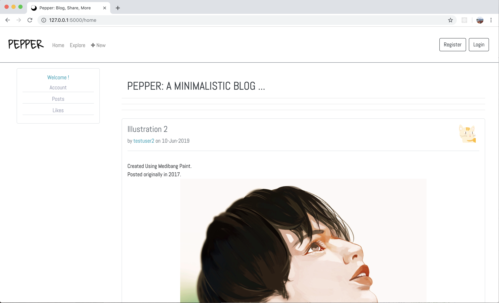
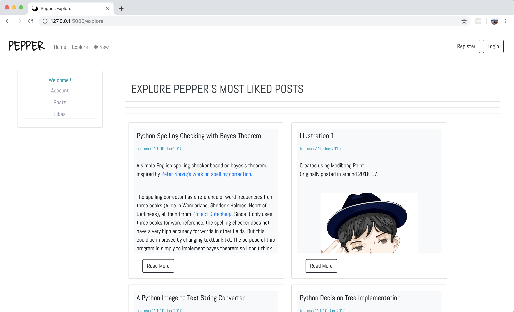

# Pepper: A Blog Written with Python and Flask
Pepper is a minimalistic blog system created with python and flask.

### Overview

### Install
To run Pepper locally, you must first have both [Python](https://www.python.org/) and Command Line installed.

Then, navigate to a project directory and clone this repository by doing     
`git clone https://github.com/iasnobmatsu/Blog-Pepper.git`    on command line.

After the repository is cloned, navigate into the repository directory and do `pip install -r requirements.txt`.

Lastly, navigate into the directory called pepper and run `python run.py`.

The blog is then running on the local host http://127.0.0.1:5000/ just copy paste into browser.

### Functionalities
most pages are available through the nav bar and the side bar

- home (login not required)
    - view posts by the order from the most recent posts 
    - 5 posts per page
    - posts can only be viewed partially on this page, click "Read More" button to view the entire post

- explore (login not required)
    - view most popular(liked) posts in card format
    - posts can only be viewed partially on this page, click "Read More" button to view the entire post

- posts (login required)
    - view all posts by the current user
    - 5 posts per page
    - posts can only be viewed partially on this page, click "Read More" button to view the entire post

- single post(login not required):
    - page for a single post accessed through either post title link or "Read More" button
    - user can like/unlike a post
    - onwer of a post can see delete and edit links that allows the deletion of editing of the post

- like(login required):
    - page for all posts liked by a user
    - posts can only be viewed partially on this page, click "Read More" button to view the entire post

- new post:+ (login required)
    - add a new post
    - support either plain text or MarkDown
    - Media objects can only be added through MarkDown

- registration (only displayed when not logged in)
    - use email address, username ,and password to sign up
    - have a link to login if already have an account

- login (only displayed when not logged in)
    - user email and password to sign in
    - have a link to sign up if no existing account

- logout (only displayed when logged in)
    - sign out current user

some sample images

